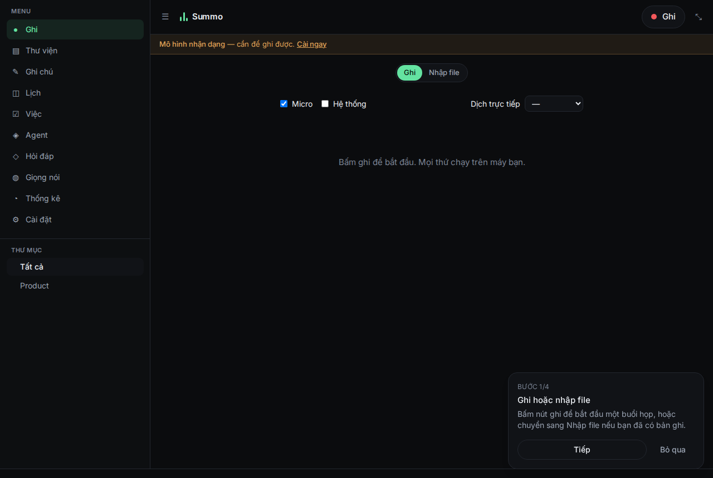
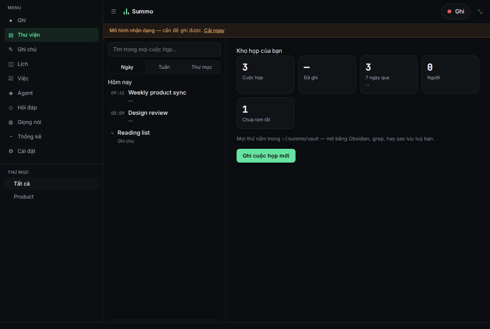
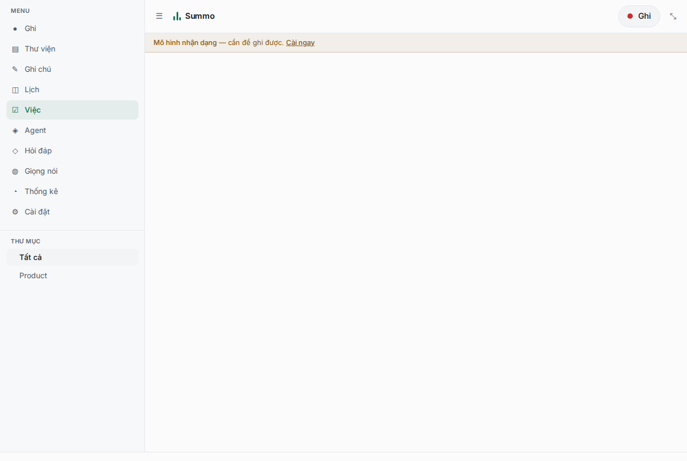
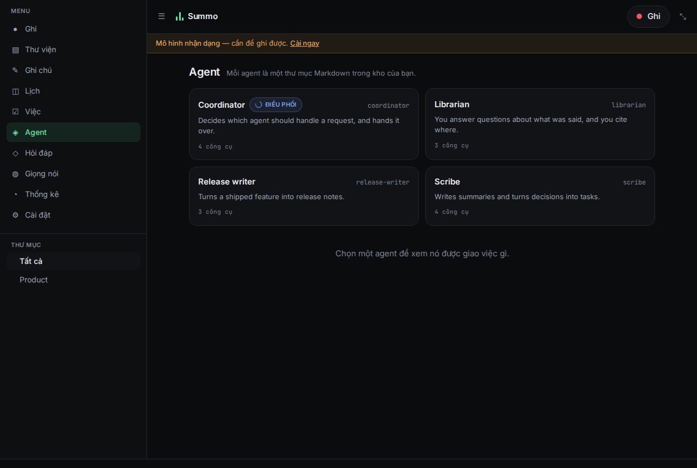
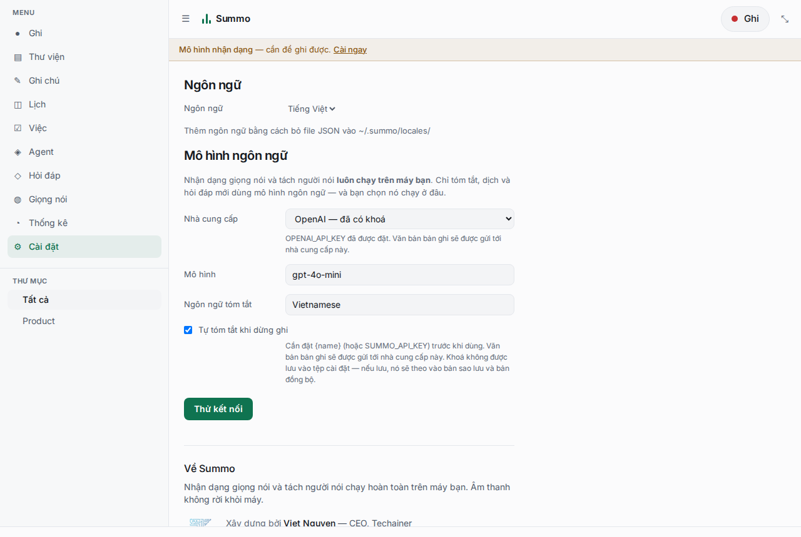

# Summo

[](https://github.com/Techainer/summo-app/actions/workflows/ci.yml)
[](LICENSE)

Meeting notes that run on your machine. Speech recognition and speaker attribution never leave the
device; only summarisation and translation call out to a language model you configure yourself.



> Status: usable end to end. Record or import, get a transcript with speakers named, an agent-drafted
> summary you approve, tasks on a board, questions answered from the vault with citations, live
> translation of whatever is playing, dubbing, notes, calendars, comments, a roster of agents you
> edit as files, and encrypted sync between machines. 2.4 % WER on Fleurs VI, RTF 0.11 with live
> partials. **Not done:** mobile is scaffolded and has never been compiled, and the hosted relay is
> not built — sync works today through any folder you both can reach. See
> [`docs/benchmarks.md`](docs/benchmarks.md) for numbers and `docs/adr/` for decisions.

|  |  |
|---|---|
|  |  |
| Every meeting and note, one index over both. | Tasks people own, and tasks the agent runs. |
|  |  |
| Each agent is a folder of Markdown in the vault. | Thirteen language-model endpoints, or your own. |

## Run it

One command, the way `ollama` is one command. The interface is compiled into the binary, so there is
no web server to start, no directory of static files to keep in step, and no install step.

```bash
./scripts/bundle.sh          # a tarball in dist/, ready to move to another machine
tar -xzf dist/summo-*.tar.gz && cd summo-* && ./summo serve
```

Or from source, without packaging:

```bash
pnpm install && pnpm --filter @summo/web build     # the interface, once
cargo run --release -p summo-cli --features bundled,models -- serve
```

That prints an address and opens it.

Two bundles. The default carries speech recognition — 24 MB, and the ONNX Runtime and sherpa-onnx
libraries travel beside the binary, which finds them there. `--no-models` is 8.5 MB and genuinely
one file: it browses a vault, imports, summarises and answers questions, and cannot transcribe.

First run has one decision in it: which speech model to download. Summo ranks what is available
against your machine and says why — memory, measured real-time factor, licence — and you can
disagree with it. Nothing is recorded until you press record.

```bash
summo serve --port 8710      # a fixed port, when something else wants to find it
summo serve --no-open        # a server, when there is no browser to open
summo import ~/Downloads/zoom-recording.mp4
summo mcp                    # the vault over MCP, for Claude Code or Cursor
```

## Why it is built this way

The expensive part of a meeting recorder is real-time transcription. Doing it locally removes the
GPU bill entirely, which is what makes it possible to sell the hosted extras cheaply — and it means
the recording of your meeting is a file on your disk rather than a row in someone's database.

Three rules follow from that, and they decide most of the design:

1. **Speech recognition and diarization are always local.** There is no cloud-ASR fallback.
2. **Recording starts in under a second**, with no dialog. Summaries run after the meeting ends,
   because that is when you want them.
3. **Your data is `~/.summo/vault`** — Markdown files you can open in Obsidian, grep, back up or
   delete. Same path on every platform, typeable from memory.

## Layout

```
crates/
  summo-core      shared types: segments, events, paths, errors
  summo-models    Ollama-style model registry: manifests, resumable downloads, blob store, hw probe
  summo-vad       voice activity detection: pluggable backends + the segment gate that drives ASR
  summo-bench     measurement harness — every default should come from a number measured here
  summo-audio     capture (mic), resampling, framing, device selection
  summo-asr       decoding sessions: pseudo-streaming, hybrid refine, sherpa runtime
  summo-vault     the Markdown vault: meetings as files you own
  summo-diar      speaker attribution: track priors, online clustering, refinement
  summo-llm       summaries, translation and Q&A — the only part that leaves the machine
  summo-store     vector index for semantic Q&A                                 [not needed yet]
  summo-engine    the local daemon: capture, recognition and events over loopback
  summo-cli       `summo serve | setup | pull | import | ask | export | registry`
  summo-agent     the agent: aionrs core, Summo's own tools
  summo-media     ffmpeg as a sidecar: probe, extract, convert
  summo-calendar  iCalendar: .ics, subscriptions, matching a recording to an event
  summo-tts       dubbing: fitting a translated line back into the slot it came from
  summo-mcp       the vault over MCP — tools, resources and prompts, on stdio or HTTP
  summo-sync      CRDT + end-to-end-encrypted multi-device sync                [next]
apps/
  web/            the application interface — React, compiled into the binary
  desktop/        the Tauri shell: window, tray, global shortcut
  mobile/         Tauri iOS/Android                          [scaffolded, never compiled]
docs/adr/         decision records
```

## Build and test

```bash
cargo test --workspace
cargo clippy --workspace --all-targets -- -D warnings
```

Backends that need a model or a native library are behind Cargo features so the default build works
anywhere:

```bash
# Silero VAD (MIT) — downloads an ONNX Runtime build on first compile
cargo test -p summo-vad --features silero
```

## Benchmarks

Defaults are chosen from measurements, not vibes. To reproduce the VAD comparison:

```bash
curl -L -o /tmp/silero_vad.onnx \
  https://github.com/snakers4/silero-vad/raw/master/src/silero_vad/data/silero_vad.onnx
git clone --depth 1 https://github.com/ten-framework/ten-vad /tmp/ten-vad

cargo run --release -p summo-bench --features silero -- vad \
  --dataset /tmp/ten-vad/testset \
  --backend silero:/tmp/silero_vad.onnx \
  --sweep
```

Results and what they changed: [`docs/adr/0001-vad-backend-licensing.md`](docs/adr/0001-vad-backend-licensing.md).

To transcribe a recording with the real pipeline:

```bash
# Vietnamese, with a Zipformer transducer
cargo run --release -p summo-cli --features transcribe -- transcribe recording.wav \
  --model-dir /path/to/gipformer-65M --vad /tmp/silero_vad.onnx --threads 4

# English, or any of Whisper's 99 languages
cargo run --release -p summo-cli --features transcribe -- transcribe recording.wav \
  --model-dir /path/to/sherpa-onnx-whisper-tiny --vad /tmp/silero_vad.onnx \
  --engine whisper --lang en
```

To check whether a search index would be worth it on your own corpus size:

```bash
cargo run --release -p summo-bench -- vault --sizes 100,1000,5000
```

## The three repositories

Summo is split along the line that matters for its promise: the app runs locally, so nothing you
need may live behind something we operate.

| Repository | Licence | What it is |
|---|---|---|
| **summo** (here) | AGPL-3.0 | The application and everything it needs to run |
| [summo-registry](https://github.com/Techainer/summo-registry) | MIT | The model catalogue — static JSON, forkable, mirrorable |
| summo-cloud | proprietary | summo.app, the CDN, billing, sync |

The dependency runs one way. This repository imports nothing from summo-cloud, and CI builds and
tests it without that repository present. The app reaches our infrastructure for three optional
things — a faster registry mirror, update manifests, and sync for whoever pays — and each falls back
to something we do not operate. Delete summo-cloud tomorrow and Summo keeps recording,
transcribing, installing models and exporting; only sync stops.

The registry is separate for a different reason: it has to outlive us. A model resolves through
`SUMMO_REGISTRY` → our CDN → the registry repository on GitHub → the URL inside the manifest, which
points at whoever published the weights.

## Licence

AGPL-3.0-or-later. Models are fetched at runtime and keep their own licences; see `NOTICE`.

## Models

Fetched at runtime from a registry of static JSON manifests, each carrying a licence, a sha256 per
file and the numbers we measured.

```bash
summo recommend --lang vi     # what would run here, and why
summo pull gipformer-65m      # 2.4% WER on Fleurs VI, 70 MB, MIT
```

Nothing is bundled. Permissive models are mirrored; gated and non-commercial ones are listed
pointing at their original host, so the user is the one who fetches them and we are never the
distributor of a licence we cannot redistribute under.

## Talking to it from another agent

Summo speaks [MCP](https://modelcontextprotocol.io), so an assistant that already has your editor
open can answer from your own transcripts rather than guessing.

```jsonc
// Claude Code, Cursor: spawn it over stdio
{ "mcpServers": { "summo": { "command": "summo", "args": ["mcp"] } } }
```

For an agent that cannot spawn a process — a container, another tool on the same machine — the
daemon serves the same thing over HTTP, behind the same token as every other route:

```bash
curl -s http://127.0.0.1:$(jq -r .port ~/.summo/engine.json)/mcp \
  -H "Authorization: Bearer $(jq -r .token ~/.summo/engine.json)" \
  -H 'content-type: application/json' \
  -d '{"jsonrpc":"2.0","id":1,"method":"resources/list"}'
```

One implementation behind both, so they cannot drift.

| | |
|---|---|
| **Tools** | `search_meetings`, `get_meeting`, `list_meetings`, `list_tasks` |
| **Resources** | every meeting and note as `summo://meeting/<id>`, rendered as Markdown |
| **Prompts** | `decisions` (what was agreed about a topic), `catch_up` |
| **Protocol** | negotiated — `2025-06-18`, `2025-03-26` and `2024-11-05` |

**It reads; it does not write.** No tool creates a task, edits a note or starts a recording. An MCP
client is a model with a tool list, and a model that misreads an instruction should not be able to
rewrite somebody's meeting notes. The URIs carry ids rather than paths, so an agent's transcript
does not end up with your home directory in it.

## Contributing

- [CONTRIBUTING.md](CONTRIBUTING.md) — how to run it, and every check CI runs so you can run them first
- [CODE_OF_CONDUCT.md](CODE_OF_CONDUCT.md)
- [SECURITY.md](SECURITY.md) — what the product promises, and where to report a hole in one
- [docs/adr/](docs/adr/) — the decisions that shaped this, and what would reopen each of them
