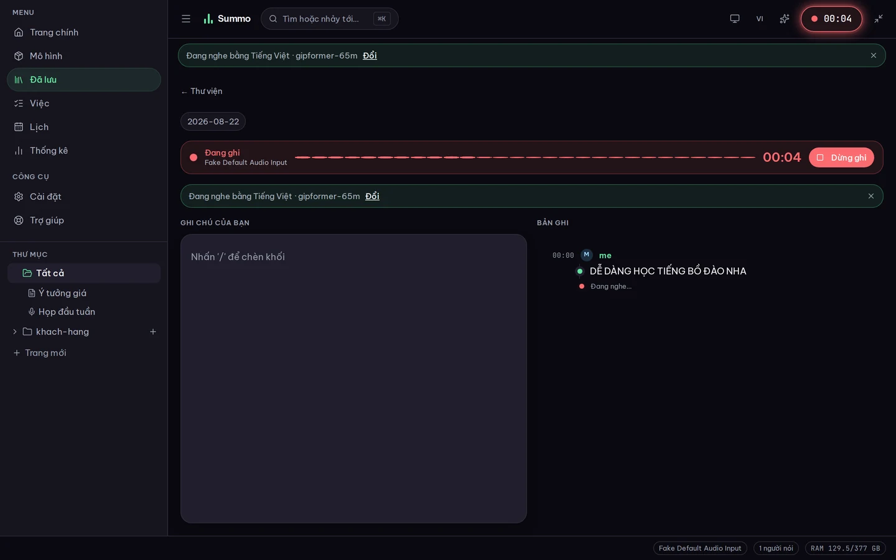
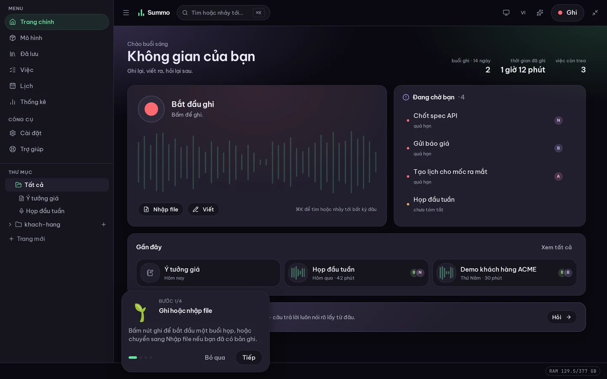
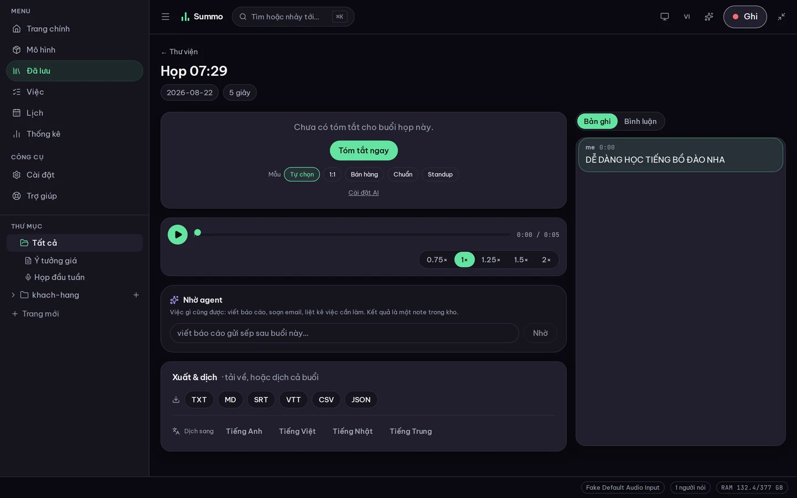
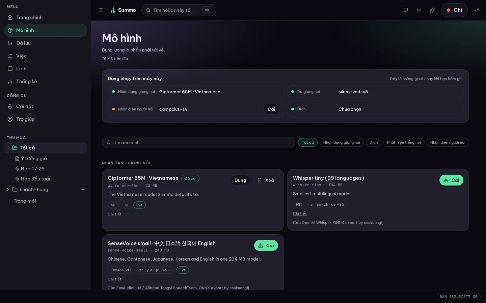
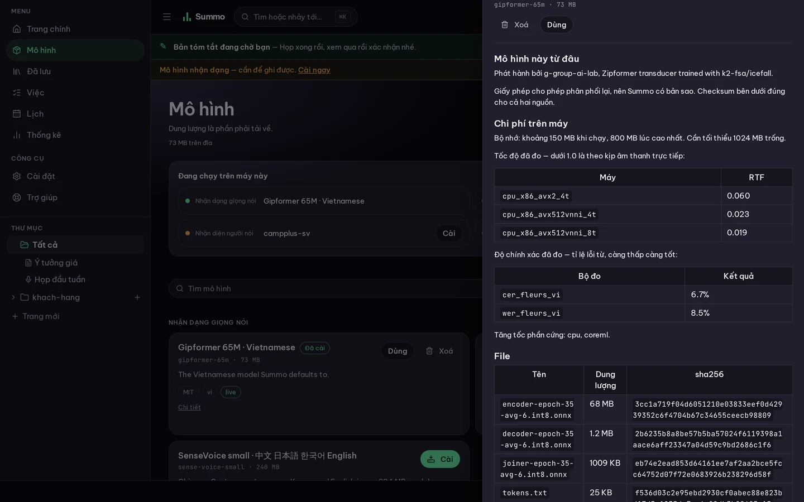

**English** | [Tiếng Việt](README.vi.md)

# Summo

[](https://github.com/Techainer/summo-app/actions/workflows/ci.yml)
[](https://github.com/Techainer/summo-app/releases/latest)
[](LICENSE)

Summo is a meeting recorder and notebook that runs on your own machine: it records or imports a
meeting, transcribes it with speakers named, and keeps the result as a Markdown file you can open,
grep, sync or delete yourself. Speech recognition and speaker attribution never leave the device;
only summarisation and translation call out to a language model, and only if you have configured one.

Product site: [summo.techainer.com](https://summo.techainer.com).



<sub>A meeting in progress. The band across the top is the recording itself — elapsed time, and a
meter that moves with the room, because "it is recording" and "it can hear you" fail separately.
Notes on the left, transcript on the right: one document, written to one Markdown file.</sub>

## The three rules

The expensive part of a meeting recorder is real-time transcription. Doing it locally removes the
GPU bill entirely, which is what makes it possible to sell the hosted extras cheaply — and it means
the recording of your meeting is a file on your disk rather than a row in someone's database. Three
rules follow from that, and they decide most of the design:

1. **Speech recognition and diarisation are always local.** There is no cloud-ASR fallback.
2. **Press record and it records** — recording starts in under a second, with no dialog box in the
   way. Summaries run after the meeting ends, because that is when you want them.
3. **Your data is `~/.summo/vault`** — Markdown files you can open in Obsidian, grep, back up or
   delete yourself. Same path on every platform, typeable from memory.

## What works today

Usable end to end: record or import a recording, get a transcript with speakers named, an
agent-drafted summary you approve, tasks on a board, questions answered from the vault with
citations, live translation of whatever is playing, dubbing, calendars, comments, a roster of agents
you edit as files, and encrypted sync between machines through any folder you both can reach. Notes
are written in a block editor with tables, pictures, drag-to-reorder and pages inside pages — over a
file that is still Markdown, and that opens as plain text rather than lose anything it cannot hold.
Subscribe to a calendar by URL and it stays current, prompts before a meeting starts — it never
records on its own — and drafts the follow-up email afterwards, which you send yourself.

**Not done:** the Android app builds, records, signs itself when the repository has a key, and has
now been run — on an emulator, which is where it was found that a release build could not reach its
own engine at all. Recognition is compiled in for phones and has never decoded audio on one, because
ONNX Runtime publishes no x86-64 Android build and an emulator cannot run the arm64 one. Treat the
phone as untested. iOS needs a Mac and has never been built. The hosted sync relay is not built either —
sync works today through any shared folder instead.

| | |
| --- | --- |
|  |  |
| **Home.** Record, import or write, with the queue of things waiting on a person beside it. | **After the meeting.** The recording, the transcript, an agent-drafted summary you approve or reject. |
|  |  |
| **Models.** What a recording would use right now — recognition, voice detection, speaker attribution, translation — above everything the registry offers. | **Every model has a page**: licence, who published it, memory, measured speed and accuracy, and the checksums. |

The numbers below are measured on this codebase, not estimated. Each is reproducible with the
command shown; see [`docs/benchmarks.md`](docs/benchmarks.md) and
[`docs/translation.md`](docs/translation.md) for the full method and caveats.

| Claim                              | Measured                                                                                                                        | Source                                                                                                |
| ---------------------------------- | ------------------------------------------------------------------------------------------------------------------------------- | ----------------------------------------------------------------------------------------------------- |
| Vietnamese recognition accuracy    | 8.5 % WER, 6.7 % CER (`gipformer-65M`, 100 FLEURS VI clips, 21.3 min; 5.3 % on the 84 clips whose reference contains no digits) | `cargo run --release -p summo-bench --features asr -- asr`                                            |
| Live pipeline speed                | RTF 0.107, roughly 9× faster than realtime (raw mic capture)                                                                    | `docs/benchmarks.md`, end-to-end pipeline section — two short single-mic captures, not yet WER-scored |
| Voice activity detection           | Silero v5, F1 0.940 (precision 0.925, recall 0.956)                                                                             | `cargo run --release -p summo-bench --features silero -- vad --sweep`                                 |
| Finding a meeting without an index | ~30 ms across 1,000 meetings (8-thread scan), which is why there is no database                                                 | `cargo run --release -p summo-bench -- vault --sizes 100,1000,5000`                                   |
| Translating a line                 | ~244 ms/line, 8 threads, with the default 583 MB `small100` model — in the released binary, with no model server to run         | `cargo run -p summo-mt --features local,onnx --example compare`                                       |

## Install and run

One command, the way `ollama` is one command. The interface is compiled into the binary, so there is
no web server to start and no directory of static files to keep in step.

```bash
./scripts/bundle.sh          # a tarball in dist/, ready to move to another machine
tar -xzf dist/summo-*.tar.gz && cd summo-* && ./summo serve
```

Releases carry four builds: Linux x64 and arm64, macOS on Apple silicon, and Windows x64.

**Intel macOS is not among them.** It was, on paper, for two releases that shipped without it:
GitHub retired the `macos-13` runner image, and a job asking for a label with no runners behind it
queues rather than failing — so the build appeared to be in progress, forever, and nobody noticed
the artifact was missing. Building it yourself still works if you have the hardware: `bundle.sh`
handles `x86_64-apple-darwin`, and `scripts/onnxruntime-intel-mac.sh` fetches the ONNX Runtime that
Microsoft stopped publishing after 1.23.2, which Summo opens at startup rather than linking.

### The app, rather than the command

```bash
pnpm -C apps/desktop exec tauri build     # .deb and .AppImage, .dmg, .msi
```

A window, a tray icon, and `⌘⇧R` from anywhere. It starts the same daemon the command above runs —
adopting one that is already up rather than competing with it — so the two are the same product with
the same vault, and either can be used.

Releases carry the installers as well as the tarball. **There is no Apple certificate behind them**,
and this is measured rather than assumed: `.github/workflows/gatekeeper.yml` downloads the published
`.dmg`, marks it the way a browser marks a download, and asks macOS what it thinks.

```
Signature=adhoc
/Applications/Summo.app: rejected            (spctl)
/Applications/Summo.app: valid on disk       (codesign --verify --deep --strict)
/Applications/Summo.app: satisfies its Designated Requirement
Adhoc Signed App — Severity: Warning         (syspolicy_check, macOS 26.5)
Notary Ticket Missing
```

Those lines say two different things, and this README used to read only the first. `rejected` means
**will not open on its own**, not **cannot be opened**: the signature is valid and satisfies its
Designated Requirement, so macOS shows the "cannot verify the developer" dialog and leaves an **Open
Anyway** button in System Settings › Privacy & Security. One press, once.

Only a *broken* signature produces "Summo is damaged and can't be opened" — and there no button
appears and a terminal is the only way through. v0.2.0 was exactly that, because it was not signed
at all; the instruction to open Terminal was written for it and outlived its cause.

If you would rather type than click, this does the same thing:

```bash
xattr -dr com.apple.quarantine /Applications/Summo.app
```

**There is no free way to remove the step entirely.** Apple's path is a Developer ID plus notarisation, $99 a year.
Everything on this side of it is done and waiting: set four secrets — `APPLE_CERTIFICATE`,
`APPLE_CERTIFICATE_PASSWORD`, `APPLE_SIGNING_IDENTITY`, and `APPLE_ID`/`APPLE_PASSWORD`/
`APPLE_TEAM_ID` — and the next tag signs and notarises itself. See `.github/workflows/release.yml`.

Windows shows a SmartScreen warning and lets you through it. The tarball has neither problem, and is
what to use if this matters to you.

Or building from source, without packaging:

```bash
pnpm install && pnpm --filter @summo/web build       # the interface, once
cargo run -p summo-cli --features serve,models -- serve
```

That prints an address and opens it. First run has one decision in it: which speech model to
download. Summo ranks what is available against your machine and says why — memory, measured
real-time factor, licence — and you can disagree with it. Nothing is recorded until you press record.

```bash
summo serve --port 8710      # a fixed port, when something else wants to find it
summo serve --no-open        # a server, when there is no browser to open
summo serve --background     # run detached; `summo status` and `summo stop` from anywhere
summo import ~/Downloads/zoom-recording.mp4
summo mcp                    # the vault over MCP, for Claude Code or Cursor
```

There are two ways to build the release bundle: with speech recognition (the ONNX Runtime and
sherpa-onnx libraries travel beside the binary), or with `--no-models`, which is smaller and browses
a vault, imports, summarises and answers questions, but cannot transcribe.

## Model catalogue

Models are not bundled with Summo. They are fetched at runtime from a registry of static JSON
manifests, each carrying a licence, a sha256 per file and the numbers measured for it:

```bash
summo recommend --lang vi     # what would run here, and why
summo pull gipformer-65m      # 2.4 % WER on Fleurs VI, ~70 MB, MIT
summo verify                  # load every installed model and run it once
```

`summo verify` is not a benchmark. Installing a model checks a sha256, which proves the bytes
arrived and nothing more — it says nothing about a manifest naming a file that is not there, an
archive that unpacked into a shape the runtime cannot open, or a build with no runtime for that
model at all. It loads each one the way a recording does, runs one inference, and exits non-zero if
anything failed. The models screen has the same check per card.

A runtime is a compile-time feature, so which models a binary can run is a property of that binary:
the release ships the ONNX translation runtime and not llama.cpp, and the catalogue says so on the
card rather than at the first translation.

The catalogue lives in [Techainer/summo-registry](https://github.com/Techainer/summo-registry) (MIT,
static JSON, forkable and mirrorable). A model resolves through `SUMMO_REGISTRY` → our CDN → the
registry repository on GitHub → the URL inside the manifest, which points at whoever published the
weights — permissive models are mirrored, gated and non-commercial ones point straight at their
original host (for example the Hugging Face repositories named in each manifest's `files[].url`), so
Summo is never the distributor of a licence it cannot redistribute under.

## Verifying the privacy claim

Disconnect the machine from the network, then run `./summo serve` and record a meeting. Recognition,
voice-activity detection and speaker attribution keep working, because they never called out — there
is no cloud-ASR fallback to fail over to. What you should _not_ be able to do offline is get a summary
or a translation from a remote model you configured, since that is the one deliberate exception to
"nothing leaves the machine".

The rest of the promise is enforced in code, not only in this description — see
[`SECURITY.md`](SECURITY.md): the daemon binds `127.0.0.1` only, every route requires a token written
to `~/.summo/engine.json`, and a browser page cannot reach it unless the daemon was started with
`--dev`, which no shipped build does.

## Architecture

```
crates/
  summo-core      shared types: segments, events, paths, errors
  summo-models    Ollama-style model registry: manifests, resumable downloads, blob store, hw probe
  summo-vad       voice activity detection: pluggable backends and the segment gate that drives ASR
  summo-asr       decoding sessions: pseudo-streaming, hybrid refine, sherpa runtime
  summo-diar      speaker attribution: track priors, online clustering, refinement
  summo-vault     the Markdown vault: meetings as files you own
  summo-llm       summaries, translation and Q&A — the only part that leaves the machine
  summo-engine    the local daemon: capture, recognition and events over loopback
  summo-cli       `summo serve | setup | pull | import | ask | export | registry`
  summo-agent     the agent: aionrs core, Summo's own tools
  summo-mcp       the vault over MCP — tools, resources and prompts, on stdio or HTTP
  summo-sync      CRDT and end-to-end-encrypted multi-device sync
apps/
  web/            the application interface — React, compiled into the binary
  desktop/        the Tauri shell: window, tray, global shortcut
  mobile/         Tauri iOS/Android — Android builds an .apk; iOS has never been built
```

`summo-bench`, `summo-audio`, `summo-media`, `summo-calendar`, `summo-tts`, `summo-store`,
`summo-mt` and `summo-pipeline` cover measurement, capture, ffmpeg, calendars, dubbing, semantic
search, in-process translation and the capture stages respectively — see `crates/` for all twenty.

## Contributing

- [CONTRIBUTING.md](CONTRIBUTING.md) — how to run it, and every check CI runs so you can run them first
- [CODE_OF_CONDUCT.md](CODE_OF_CONDUCT.md)
- [SECURITY.md](SECURITY.md) — what the product promises, and where to report a hole in one
- [docs/adr/](docs/adr/) — the decisions that shaped this, and what would reopen each of them
- [docs/secrets.md](docs/secrets.md) — which secrets this repository takes, and what each one buys

## Licence

AGPL-3.0-or-later. Models are fetched at runtime and keep their own licences; see
[`NOTICE`](NOTICE). The application itself is split from the hosted extras on purpose: this
repository imports nothing from `summo-cloud`, the proprietary repository that runs the CDN, billing
and the sync relay — delete it and Summo keeps recording, transcribing, installing models and
exporting, and only sync stops.
