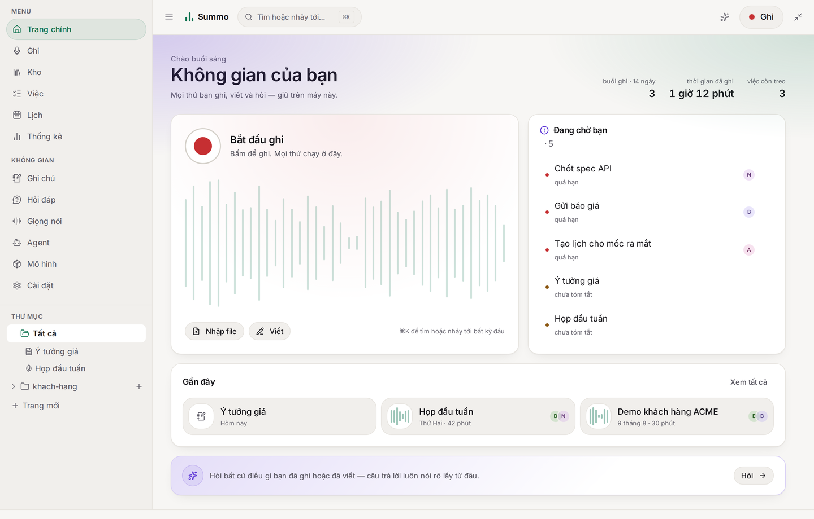
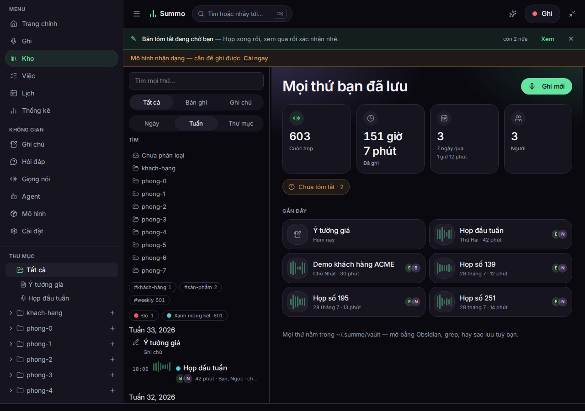
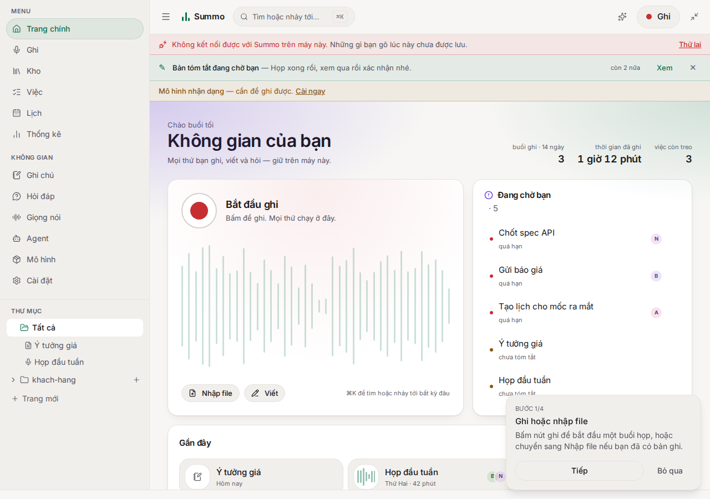
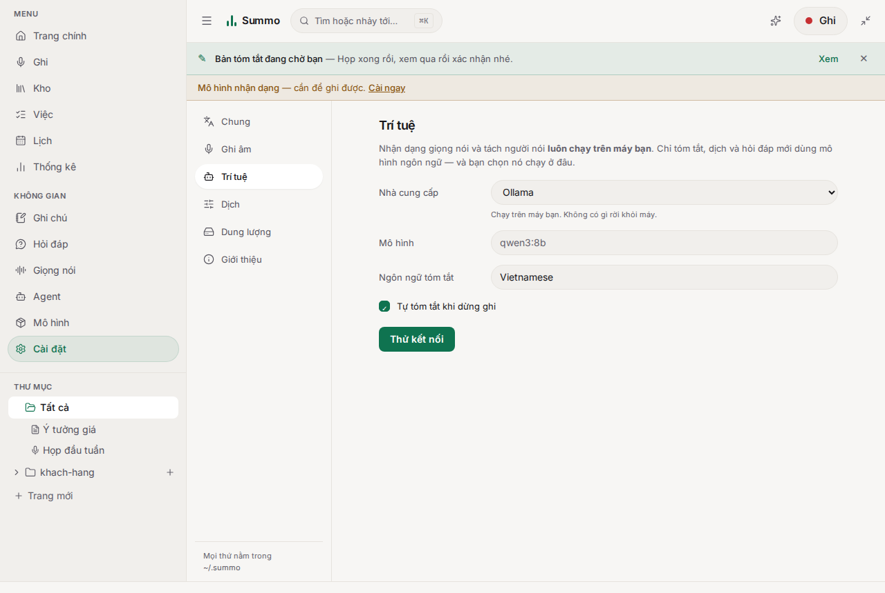
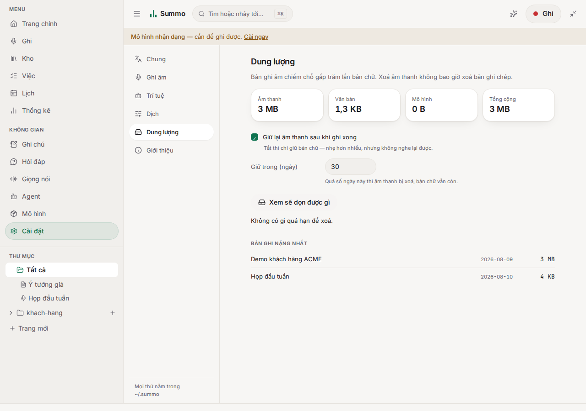
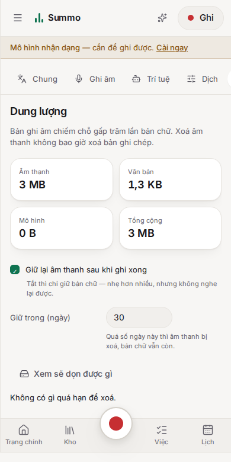
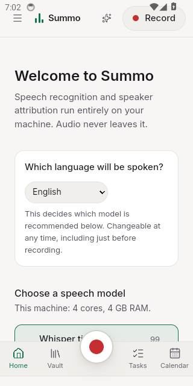
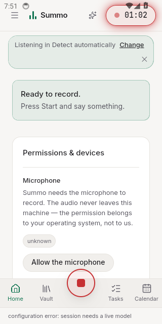

# Báo cáo — đêm 15 rạng 16/08/2026

Bản mới nhất. Bản cũ đã xoá; những gì còn giá trị đều nằm ở đây.

Ba dòng việc trong đêm: **chạy thật những thứ chưa ai chạy**, **tối ưu những chỗ chỉ lộ ra khi
dữ liệu nhiều**, và **làm nốt phần đã có ở daemon nhưng chưa có giao diện**.



---

## 1. Kho 1.000 cuộc họp: danh sách vô hình, và mở mất 5,6 giây

Mọi bộ kiểm thử trong repo chạy trên **ba tài liệu** — đúng bằng kho của người vừa cài sáng nay.
Gieo 1.000 rồi 5.000 cuộc họp, hai lỗi hiện ra mà không kiểm thử nào trước đó thấy được.

**Danh sách vô hình.** Mỗi dòng bắt đầu ở `opacity: 0` rồi hiện dần theo thứ tự. Bước nhảy là một
hằng số, nên độ trễ lớn dần theo độ dài danh sách. Đo được: dòng thứ **800 vẫn trong suốt sau 10
giây**, cả kho mất **nửa phút** mới hiện xong.

```
t+0s : 1003 dòng · #1 0.94 · #201 0.00 · #801 0.00 · vô hình 994
t+3s : 1003 dòng · #1 1.00 · #201 0.99 · #801 0.00 · vô hình 794
t+10s: 1003 dòng · #1 1.00 · #201 1.00 · #801 0.00 · vô hình 306
t+30s: 1003 dòng · #1 1.00 · #201 1.00 · #801 1.00 · vô hình 0
```

**Vẽ hết mọi thứ.** 5.000 cuộc họp = **125.833 node DOM**, **5,6 giây** từ lúc bấm tới dòng đầu
tiên, trên máy không chạy gì khác.

Sửa: hiệu ứng giữ **toàn bộ** danh sách trong 400 ms bất kể dài bao nhiêu; danh sách vẽ 120 dòng
rồi tự mọc thêm khi cuộn tới đáy, kèm nút thật ghi rõ còn bao nhiêu (bàn phím và trình đọc màn
hình cần một cái nút, không phải một sentinel).

| Kho | Trước | Sau |
|---|---|---|
| 1.000 họp | 1,2 s · 25.833 node · dòng cuối hiện ở giây 15 | 0,3 s · ~3.400 node · hiện hết dưới 1 s |
| 5.000 họp | 5,6 s · 125.833 node | 1,5 s · 3.601 node |

`e2e/scale.mjs` gieo 600 cuộc họp và kiểm cả hai tính chất. Chạy trên bản **trước khi sửa** nó báo
`603 of 600 rows were drawn at once` và `346 rows were drawn but invisible a second after the
library opened` — tức là kiểm thử này thất bại nếu bản sửa biến mất.



**PR [#48](https://github.com/Techainer/summo-app/pull/48) — đã gộp.**

---

## 2. Daemon chết mà ứng dụng không nói gì

Giao diện là một trang do một tiến trình trên cùng máy phục vụ. Tiến trình đó có thể biến mất: sập,
bị thoát từ khay hệ thống, máy ngủ dậy mất cổng.

Giết daemon dưới chân ứng dụng đang mở: bố cục vẫn nguyên, các cuộc họp đã tải vẫn nằm trên màn
hình, **gõ vào một ghi chú suốt 4 giây** — mọi request `ERR_CONNECTION_REFUSED` trong console không
ai đọc — và không một chữ nào báo. Gõ xong tải lại trang là mất.

Ghi âm thì đã có: WebSocket tự kết nối lại và thanh trạng thái nói rõ. Nhưng socket chỉ tồn tại khi
đang ghi, nên **mọi phút còn lại của ứng dụng không được canh**.

Sửa: dò `/health` 5 giây một lần, 1,5 giây khi có vấn đề; **hai lần liên tiếp mới báo** (daemon
khởi động lại sau cập nhật rớt đúng một request, thanh cảnh báo nhấp nháy là thanh không ai đọc
nữa). Câu thông báo nói về *việc của người dùng* chứ không nói về socket: “Những gì bạn gõ lúc này
chưa được lưu.” Không tắt được, và **không che ứng dụng** — thứ đang trên màn hình lúc đó là bản
duy nhất của những gì chưa lưu.



**PR [#49](https://github.com/Techainer/summo-app/pull/49) — đang mở, CI xanh.**

---

## 3. Cài đặt: sáu mục có thanh bên, và mục chưa từng có giao diện

Trước: một cột hẹp dài sáu màn hình — ngôn ngữ, giao diện sáng tối, quyền micro, ngôn ngữ nói, mô
hình tóm tắt với 8 trường, mô hình dịch với 5 trường nữa, phiên bản ở đáy. Tất cả luôn được mount
và fetch dù không ai nhìn. Tìm một cài đặt nghĩa là cuộn qua mọi cài đặt khác.

Giờ: **sáu mục**, thanh bên trên desktop, hàng pill cuộn ngang trên điện thoại (**45 px** của màn
hình 780 px, không phải một phần ba). `?section=` nằm trong URL nên một cài đặt là một đường dẫn —
checklist onboarding, nhắc nhở về dung lượng và bảng ⌘K đều gửi người dùng tới đúng chỗ.



**Dung lượng là mục chưa từng có giao diện.** Daemon đã đo dung lượng từ khi có kho (`GET /storage`),
đã áp chính sách giữ âm thanh mỗi lần khởi động (`POST /storage/prune`), và `settings.storage` quyết
định cả hai — nhưng **không có cách nào đổi ngoài việc mở `~/.summo/settings.toml` bằng trình soạn
thảo**. “Bạn giữ bản ghi âm của tôi bao lâu” là câu hỏi một ứng dụng chạy tại máy có nghĩa vụ trả
lời trên màn hình.

Thêm `POST /settings/storage`, nhận từng trường một (gửi cả hai thì một checkbox cũ có thể ghi đè
con số vừa gõ). Bảng hiển thị âm thanh / văn bản / mô hình / tổng, các bản ghi nặng nhất, và số thư
mục âm thanh không còn cuộc họp. Xoá đi **hai bước** — xem *sẽ* xoá gì, rồi mới xác nhận — giống
đúng cách daemon hành xử (prune không tham số là chạy khô).




**PR [#50](https://github.com/Techainer/summo-app/pull/50) — đang mở.**

---

## 4. Trang giới thiệu: 11 màn hình thật, và bằng chứng thay cho lời khen

Trang cũ có **ba** ảnh và không có phần social proof.

**Thư viện ảnh là lập luận.** Summo không phải một màn hình: nó là kho, một cuộc họp có biên bản
gắn mốc thời gian, bảng việc, danh mục mô hình, sổ giọng nói, thống kê, cài đặt có chính sách giữ
âm thanh, ⌘K trên mọi thứ — sáng và tối. Ba ảnh không nói được điều đó. Giờ là **11 ảnh**, mỗi ảnh
một chú thích nói nó chứng minh điều gì, cộng bố cục điện thoại **chụp đúng khổ điện thoại** chứ
không thu nhỏ ảnh desktop (thanh dưới và bộ lọc gấp là thật; thu nhỏ ảnh desktop là minh hoạ một bố
cục không tồn tại). Tất cả đều chụp từ bản đang chạy trên kho thật. WebP, 2,6 MB cho cả bộ, mọi ảnh
dưới màn đầu đều lazy.

**Chỗ đáng lẽ là testimonial thì để bằng chứng.** Chưa có người dùng nào để trích lời. Viết đại ba
câu khen là việc dễ nhất trên một landing page và là việc sản phẩm này không được phép làm: một
trang lấy lập luận “lời bạn nói ở lại máy bạn, và chúng tôi không nói dối về điều đó” thì không thể
mở đầu bằng một người không có thật. Nên phần đó nói thẳng như vậy, rồi đưa những thứ kiểm chứng
được: câu mà bài kiểm thử đầu-cuối đọc ra được từ chính đoạn ghi âm nó tạo qua micro thật, số lượng
kiểm thử kèm lệnh chạy lại, smoke test mở bản đóng gói và bản Android trước khi phát hành, và kho
mã. Thẻ cuối xin phản hồi thật, kèm link mở issue.

> **Lưu ý cho bạn:** có lời của người thật lúc nào, thay vào chỗ đó lúc đó. Bạn gửi câu nào tôi ghép
> câu đó — kèm tên, nơi làm việc, ảnh nếu có, đúng như openwhispr đang làm với các tweet.

**Và CI của trang giới thiệu chưa từng chạy xong lần nào.** Mọi lần chạy trên `main` từ khi tạo
repo đều đỏ ở đúng một chỗ: `wait-on http://127.0.0.1:4190` hết giờ. Nguyên nhân nằm bốn dòng phía
trên trong log, trong cái khung pnpm vẽ quanh một cảnh báo: `Ignored build scripts: esbuild, sharp,
workerd.` pnpm 10 không chạy script cài của dependency trừ khi được gọi tên; `wrangler dev` cần
workerd, mà binary workerd tải về đúng bằng một script như vậy. Sau khi gọi tên ba cái đó, wrangler
lên được — rồi lộ tiếp hai lỗi nữa: nó bind `localhost` (trên runner là `::1`) trong khi vòng chờ
nhìn `127.0.0.1`, và cuối cùng bước kiểm tra **chạy quá 25 phút không xong** dù cùng bộ file đó
kiểm tra tại đây hết 70 giây. Nên bước đó giờ phục vụ file tĩnh — thứ mà bản export vốn là — và
kiểm tra tương phản, tràn khung, giảm chuyển động **lần đầu tiên chạy xong**: 2 phút 57.

**PR [Techainer/summo-site#1](https://github.com/Techainer/summo-site/pull/1) — đã gộp.**

---

## Việc đã kiểm chứng thật

- 1.340 kiểm thử Rust, 392 kiểm thử giao diện, 22 kịch bản trình duyệt (thêm `scale.mjs`,
  `offline.mjs`, `settings.mjs`).
- Bản đóng gói desktop khởi động dưới Xvfb trong CI; bản Android cài và mở trong máy ảo.
- Đo tốc độ tìm kiếm trên **bản tối ưu** (không phải bản debug): kho 5.000 cuộc họp, `/library`
  181 ms, tìm trúng 101 ms, tìm trượt 392 ms.

## Việc thử rồi bỏ

- **Tối ưu `find_lines`** (gấp chữ một lần cho cả tài liệu thay vì từng dòng): trên bản tối ưu,
  392 ms so với 402 ms — nằm trong sai số. Không đáng đổi lấy phức tạp, nên **bỏ**. Đo trước rồi
  mới quyết, không giữ lại một “tối ưu” không đo được.

## Việc chưa làm được ở đây

- **Chứng chỉ ký macOS/Windows** — không có certificate.
- **iOS** — cần máy Mac có Xcode.
- **Điện thoại thật** — mới chỉ chạy máy ảo x86-64; bản arm64 có nhận dạng đã link được nhưng
  **chưa từng giải mã âm thanh trên điện thoại thật**.
- **Ảnh Android trên trang giới thiệu** — ảnh máy ảo chỉ 320×640, đưa lên trang sẽ vỡ. Cần chụp
  trên máy thật.




## Việc bạn cần làm

Nạp secret ký Android (chạy bằng `!` trong phiên này; giá trị đọc từ file nên không lọt vào history
hay `ps`):

```
gh secret set ANDROID_KEYSTORE_BASE64   --repo Techainer/summo-app < /root/summo.keystore.base64
gh secret set ANDROID_KEYSTORE_PASSWORD --repo Techainer/summo-app < /root/.summo-android-keystore-password
gh secret set ANDROID_KEY_PASSWORD      --repo Techainer/summo-app < /root/.summo-android-keystore-password
printf 'summo' | gh secret set ANDROID_KEY_ALIAS --repo Techainer/summo-app
```

Sao lưu `/root/summo.keystore` ra chỗ khác — Android định danh app bằng chữ ký, mất key là không
cập nhật được app đã phát hành.

Token GitHub từng dán trong hội thoại vẫn nên xoay vòng.
